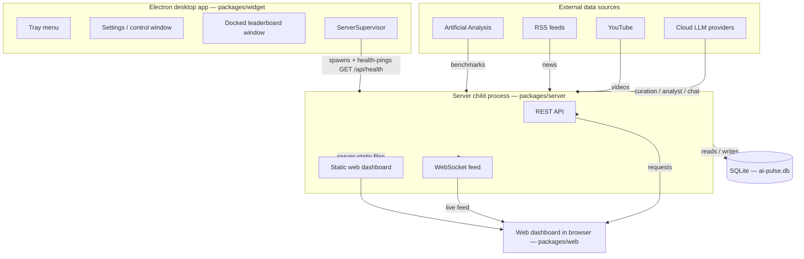

# Architecture

AI Pulse is a local "AI model radar" for Windows. It combines a news feed, benchmark rankings, an AI‑analyst briefing, an embedded chat with a web‑search agent, a "My Stack" upgrade advisor, and an always‑on desktop leaderboard widget — all driven from a single desktop app.

This document explains how the pieces fit together: the three packages, the supervisor process model, and how data flows through a poll cycle.

> Related docs: project overview in [`../README.md`](../README.md); API keys and file locations in [`./CONFIGURATION.md`](./CONFIGURATION.md); installing the app in [`./INSTALL.md`](./INSTALL.md); dev commands in [`./CONTRIBUTING.md`](../CONTRIBUTING.md); CI and tagging in [`./RELEASING.md`](./RELEASING.md).

## Overview

AI Pulse is a **monorepo** managed with **npm workspaces**. It ships as three packages, each with a distinct responsibility:

| Package | Type | Responsibility |
| --- | --- | --- |
| `packages/widget` | Electron desktop app | The single entry point and control surface. Supervises the server, and owns the tray, the Settings/control window, and the docked leaderboard window. |
| `packages/server` | Node service | Node + Express + WebSocket + SQLite. Polls data sources, runs the AI analyst, and serves the REST API, the WebSocket feed, and the static web dashboard. |
| `packages/web` | Static browser dashboard | A **content view only** — news, benchmarks, videos, chat, and briefings. Served by the server. |

The Electron app is the only place you edit configuration; the web dashboard is purely for viewing content.

## The three packages

### `packages/widget` — the desktop app (control surface)

The Electron app is the **single entry point**. Its main process:

- **Supervises the server** as a child process (see [Process model](#process-model)).
- Shows the **tray** with `Restart/Stop/Start Background Service` and `Quit AI Pulse` (which stops both the server and the app).
- Shows the **Settings/control window** — the one place you edit API keys and preferences.
- Shows the **docked leaderboard window** — the always‑on desktop widget.

The web dashboard's settings gear no longer edits anything itself: it redirects to the desktop app via the `aipulse://` deep link, with an in‑browser fallback drawer if the app isn't installed.

### `packages/server` — the Node service

The server is the workhorse. It:

- Polls **Artificial Analysis** for benchmarks, **RSS feeds** for news, and **YouTube** for creator videos.
- Runs the **AI analyst** to curate and brief.
- Persists everything to **SQLite** (`better-sqlite3`).
- Serves the **REST API**, the **WebSocket feed**, and the **static web dashboard**.

It listens on **port 3847** by default (configurable in Settings).

### `packages/web` — the static dashboard

A static browser dashboard served by the server. It renders news, benchmarks, videos, chat, and briefings. It holds no configuration — its settings gear defers to the desktop app.

## Process model

The Electron **main process supervises the server as a child process**. It spawns the server using Electron's bundled Node — `child_process.spawn` with `ELECTRON_RUN_AS_NODE=1` — so no separate Node install is required.

A **`ServerSupervisor`** keeps the child healthy:

- It **health‑pings `GET /api/health` every 20s**.
- On a **crash**, it restarts the server with **exponential backoff capped at 30s**.
- On a **hang** (after **3 consecutive failed health checks**), it restarts the server.

Server `stdout`/`stderr` are written to `userData/logs/server.log`, **rotated at 5 MB**. Service controls (`Restart/Stop/Start Background Service`) and `Quit AI Pulse` live in the tray.

## Request / data flow

A **poll cycle** moves data from the outside world into SQLite, decides what changed, and pushes updates to any connected clients:

1. **Fetch.** Pull the latest benchmarks (Artificial Analysis), news (RSS), and videos (YouTube).
2. **Upsert.** Write the fetched records into SQLite.
3. **Detect changes.** Compare against what's already stored to find new models, leader changes, breaking news, and other deltas.
4. **Run the analyst.** The **LLM router** (see below) curates and produces briefings/analysis for the changes.
5. **Broadcast.** Push updates over the **WebSocket** feed to connected dashboards **and send Windows notifications** for relevant events.

Alongside the poll cycle, clients read content on demand via the **REST API**, and the embedded **chat** answers questions through its web‑search agent.

### AI curation reliability

Curation is **cloud‑only** (no local models). An **LLM router** rotates across free cloud providers, using the first that answers with valid JSON, in this order:

| # | Provider / model |
| --- | --- |
| 1 | Gemini 3.5 Flash |
| 2 | Cerebras Llama 3.3 70B |
| 3 | Groq Llama 3.1 8B |
| 4 | OpenRouter Llama 3.3 70B (`:free`) |
| 5 | Gemini 2.5 Flash |
| 6 | OpenRouter DeepSeek V3 (`:free`) |

Each candidate has **independent backoff**:

- **Rate‑limited** (`429` / quota): honors the provider's retry hint.
- **Unavailable** (bad model id / `400`/`401`/`403`/`404`): parks for **~12h**.
- **Transient** errors: cool down for **~2m**.

Curation **never silently degrades**. Every run records which provider served it — or that it fell back to deterministic **"rules"** — in the DB. `GET /api/health` returns full provider status plus the last outcome, so the app can show `AI: Gemini ✓` or `AI: degraded (rules)`. You need **at least one** provider key; adding more makes curation more resilient.

## Key modules per package

### `packages/server`

| Path | Role |
| --- | --- |
| `fetchers/` | Pull benchmarks (Artificial Analysis), news (RSS), and videos (YouTube). |
| `analyst/llm-router.ts` | Routes curation across cloud providers with per‑provider backoff. |
| `analyst/engine.ts` | Runs the AI analyst / curation logic. |
| `poll-health.ts` | Records poll outcomes and provider status surfaced by `/api/health`. |
| `db.ts` | SQLite access via `better-sqlite3`. |
| `chat/` | The embedded chat web‑search agent. |

### `packages/widget`

| Path | Role |
| --- | --- |
| `main.ts` | Electron main process: windows, tray, and app lifecycle. |
| `src/supervisor.ts` | `ServerSupervisor` — spawns, health‑pings, and restarts the server child. |
| `src/config.ts` | Loads and edits `config.json` (API keys + preferences). |
| `src/paths.ts` | Resolves userData, resource, DB, and log locations. |
| `renderer/settings.*` | The Settings/control window UI. |

## Serving and endpoints

The server both serves the dashboard and exposes the live/data APIs:

- **Static web dashboard** — the `packages/web` content view, served directly by the server.
- **REST API** — on‑demand reads, including `GET /api/health` for supervisor health‑pings and provider status.
- **WebSocket feed** — live push of poll updates to connected dashboards.

For configuration, data locations, and how keys reach the server child, see [`./CONFIGURATION.md`](./CONFIGURATION.md).
