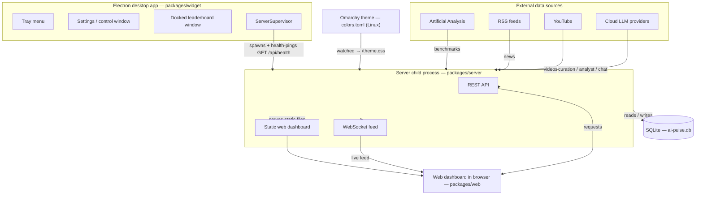

# Architecture

AI Pulse is a local "AI model radar" for Windows and Linux (Omarchy/Hyprland). It combines a news feed, benchmark rankings, an AI‑analyst briefing, an embedded chat with a web‑search agent, a "My Stack" upgrade advisor, and an always‑on desktop leaderboard widget — all driven from a single desktop app.

This document explains how the pieces fit together: the three packages, the supervisor process model, and how data flows through a poll cycle.

> Related docs: project overview in [`../README.md`](../README.md); API keys and file locations in [`./CONFIGURATION.md`](./CONFIGURATION.md); installing the app in [`./INSTALL.md`](./INSTALL.md); dev commands in [`./CONTRIBUTING.md`](../CONTRIBUTING.md); CI and tagging in [`./RELEASING.md`](./RELEASING.md).

## Overview

AI Pulse is a **monorepo** managed with **npm workspaces**. It ships as three packages, plus an optional Omarchy bar plugin, each with a distinct responsibility:

| Package | Type | Responsibility |
| --- | --- | --- |
| `packages/widget` | Electron desktop app | The single entry point and control surface. Supervises the server, and owns the tray, the Settings/control window, and the docked leaderboard window. |
| `packages/server` | Node service | Node + Express + WebSocket + SQLite. Polls data sources, runs the AI analyst, and serves the REST API, the WebSocket feed, and the static web dashboard. |
| `packages/web` | Static browser dashboard | A **content view only** — news, benchmarks, videos, chat, and briefings. Served by the server. |
| `packages/omarchy-plugin` | omarchy-shell plugin | Optional bar widget (`fernando.ai-pulse`) for Omarchy: shows the current leader and opens the dashboard/Settings. Installed by `npm run linux:install`, not shipped inside the app packages. |

The Electron app is the only place you edit configuration; the web dashboard is purely for viewing content.

## The three packages

### `packages/widget` — the desktop app (control surface)

The Electron app is the **single entry point**. Its main process:

- **Supervises the server** as a child process (see [Process model](#process-model)).
- Shows the **tray** with `Restart/Stop/Start Background Service` and `Quit AI Pulse` (which stops both the server and the app).
- Shows the **Settings/control window** — the one place you edit API keys and preferences.
- Shows the **docked leaderboard window** — the always‑on desktop widget.
- **Integrates with the desktop per OS** (`src/platform.ts`). On Windows the NSIS installer provides the shortcuts and the `aipulse://` registry entry, and "Start on login" is an `HKCU` Run entry. On Linux the app itself writes, on every start, `~/.local/share/applications/ai-pulse.desktop` (launcher + `aipulse://` handler via `xdg-mime`), the hicolor icon, and — while "Start on login" is on — `~/.config/autostart/ai-pulse.desktop`. The tray is a StatusNotifierItem over D-Bus there (no appindicator library needed).

The web dashboard's settings gear no longer edits anything itself: it redirects to the desktop app via the `aipulse://` deep link, with an in‑browser fallback drawer if the app isn't installed.

### `packages/server` — the Node service

The server is the workhorse. It:

- Polls **Artificial Analysis** for benchmarks, **RSS feeds** for news, and **YouTube** for creator **and company** videos.
- Runs the **AI analyst** to curate and brief.
- Persists everything to **SQLite** (`better-sqlite3`).
- Serves the **REST API**, the **WebSocket feed**, and the **static web dashboard**.

It listens on **port 3847** by default (configurable in Settings).

### `packages/web` — the static dashboard

A static browser dashboard served by the server. It renders news, benchmarks, creator videos, company videos, chat, and briefings. It holds no configuration — its settings gear defers to the desktop app.

## Process model

The Electron **main process supervises the server as a child process**. It spawns the server using Electron's bundled Node — `child_process.spawn` with `ELECTRON_RUN_AS_NODE=1` — so no separate Node install is required.

A **`ServerSupervisor`** keeps the child healthy:

- It **health‑pings `GET /api/health` every 20s**.
- On a **crash**, it restarts the server with **exponential backoff capped at 30s**.
- On a **hang** (after **3 consecutive failed health checks**), it restarts the server.

Server `stdout`/`stderr` are written to `userData/logs/server.log`, **rotated at 5 MB**. Service controls (`Restart/Stop/Start Background Service`) and `Quit AI Pulse` live in the tray.

The server binds **`127.0.0.1`** by default (`AI_PULSE_BIND_HOST=0.0.0.0` to expose it), restricts CORS to its own origins, and shuts down cleanly on `SIGTERM`/`SIGINT`, checkpointing SQLite first. `GET /api/health` carries `app: "ai-pulse"`, `version` (from `AI_PULSE_VERSION`, which the app sets when spawning) and `pid`; the supervisor only **adopts** an already-running listener on the port if it identifies itself that way, so a stranger on 3847 is treated as a port conflict rather than as our server.

```mermaid
flowchart TD
    subgraph Electron["Electron desktop app — packages/widget"]
        Tray["Tray menu"]
        Settings["Settings / control window"]
        Leaderboard["Docked leaderboard window"]
        Supervisor["ServerSupervisor"]
    end

    subgraph Server["Server child process — packages/server"]
        REST["REST API"]
        WS["WebSocket feed"]
        StaticWeb["Static web dashboard"]
    end

    DB[("SQLite — ai-pulse.db")]
    Browser["Web dashboard in browser — packages/web"]
    Theme["Omarchy theme — colors.toml (Linux)"]

    subgraph Sources["External data sources"]
        AA["Artificial Analysis"]
        RSS["RSS feeds"]
        YT["YouTube"]
        LLM["Cloud LLM providers"]
    end

    Supervisor -- "spawns + health-pings GET /api/health" --> Server
    Server -- "reads / writes" --> DB
    Server -- "serves static files" --> StaticWeb --> Browser
    Server --> WS -- "live feed" --> Browser
    Server --> REST -- "requests" --> Browser
    Theme -- "watched → /theme.css" --> Server

    AA -- "benchmarks" --> Server
    RSS -- "news" --> Server
    YT -- "videos" --> Server
    LLM -- "curation / analyst / chat" --> Server
```

## Request / data flow

A **poll cycle** moves data from the outside world into SQLite, decides what changed, and pushes updates to any connected clients:

1. **Fetch.** Pull the latest benchmarks (Artificial Analysis), news (RSS), and videos (YouTube creators + companies).
2. **Upsert.** Write the fetched records into SQLite.
3. **Detect changes.** Compare against what's already stored to find new models, leader changes, breaking news, and other deltas.
4. **Run the analyst.** The **LLM router** (see below) curates and produces briefings/analysis for the changes.
5. **Broadcast.** Push updates over the **WebSocket** feed to connected dashboards **and send desktop notifications** (Windows toasts; `notify-send`/libnotify on Linux) for relevant events.

Alongside the poll cycle, clients read content on demand via the **REST API**, and the embedded **chat** answers questions through its web‑search agent.

### AI curation reliability

Curation is **cloud‑only** (no local models). An **LLM router** rotates across free cloud providers, using the first that answers with valid JSON, in this order:

| # | Provider / model |
| --- | --- |
| 1 | Gemini 3.5 Flash |
| 2 | Cerebras Llama 3.3 70B |
| 3 | Groq Llama 3.1 8B |
| 4 | OpenRouter Llama 3.3 70B (`:free`) |
| 5 | Gemini 2.5 Flash |
| 6 | OpenRouter DeepSeek V3 (`:free`) |

Each candidate has **independent backoff**:

- **Rate‑limited** (`429` / quota): honors the provider's retry hint.
- **Unavailable** (bad model id / `400`/`401`/`403`/`404`): parks for **~12h**.
- **Transient** errors: cool down for **~2m**.

Curation **never silently degrades**. Every run records which provider served it — or that it fell back to deterministic **"rules"** — in the DB. `GET /api/health` returns full provider status plus the last outcome, so the app can show `AI: Gemini ✓` or `AI: degraded (rules)`. You need **at least one** provider key; adding more makes curation more resilient.

## Key modules per package

### `packages/server`

| Path | Role |
| --- | --- |
| `fetchers/` | Pull benchmarks (Artificial Analysis), news (RSS), and videos (YouTube). |
| `collapse-variants.ts` | Presentation-only collapse of effort/reasoning variants for the leaderboard. |
| `rankings.ts` | Builds `/api/rankings` after collapse; winners and ★ always point at a visible row. |
| `analyst/llm-router.ts` | Routes curation across cloud providers with per‑provider backoff. |
| `analyst/engine.ts` | Runs the AI analyst / curation logic. |
| `poll-health.ts` | Records poll outcomes and provider status surfaced by `/api/health`. |
| `db.ts` | SQLite access via `better-sqlite3`. |
| `chat/` | The embedded chat web‑search agent. |
| `theme.ts` | Omarchy theme bridge: reads `colors.toml`, serves `/theme.css`, `/api/theme`, `/api/theme/reload`, and pushes `{type:"theme"}` over the WebSocket. |

## Video `kind` and client contracts

Each `VideoItem` has `kind: "creator" | "company"` (absent = creator). `migrateVideoColumns` adds the column with default `'creator'` so existing rows stay valid. `GET /api/videos` without `kind` returns **creators only** — that is the contract the compact widget (`?limit=3`) and older bundled dashboards rely on. `?kind=company` feeds the Companies panel; `?kind=all` is available for tooling.

The WebSocket payload `{type:"videos"}` keeps `items` as creators and adds `companyItems` for the Companies panel. Do not rename those fields.

Company channels live in `config/sources.json` as `companyChannels` (same shape as `youtubeChannels`). They are polled alongside creators; a company-fetch failure must not block creator persist/broadcast.

## Variant collapse (presentation only)

`merge-models.ts` still merges **by slug** so variants stay separate in SQLite. `buildRankingsSnapshot` sorts by intelligence, then `collapseVariants` groups effort/reasoning siblings and keeps one survivor (highest intelligence → highest coding → lowest price). The snapshot includes `variantAliases` (collapsed slug → visible slug) and `variantsCollapsed`. Clients resolve saved My Stack slugs through that map so `#N PRI` and `row-mine` stay on a visible row. `/api/models` still lists every variant so the user can pick the exact one.

### `packages/widget`

| Path | Role |
| --- | --- |
| `main.ts` | Electron main process: windows, tray, and app lifecycle. |
| `src/supervisor.ts` | `ServerSupervisor` — spawns, health‑pings, and restarts the server child. |
| `src/config.ts` | Loads and edits `config.json` (API keys + preferences). |
| `src/paths.ts` | Resolves userData, resource, DB, and log locations. |
| `src/platform.ts` | Linux desktop integration: `.desktop` entry, icon, `aipulse://` handler, XDG autostart. |
| `renderer/settings.*` | The Settings/control window UI. |
| `linux/hypr/ai-pulse.lua` | Hyprland window rule for the leaderboard (float, pin, dock right below the bar). |
| `linux/hooks/ai-pulse-theme-set` | Omarchy `theme-set` hook: `POST /api/theme/reload` on theme switch. |
| `scripts/linux-install.mjs` | `npm run linux:install` / `linux:uninstall` — installs the rule, the hook, and the bar plugin into `~/.config`. |

### `packages/omarchy-plugin`

| Path | Role |
| --- | --- |
| `fernando.ai-pulse/manifest.json` | Plugin manifest (settings: `port`, `interval`, `showLeader`, `maxChars`). |
| `fernando.ai-pulse/BarWidget.qml` | The bar widget: current leader (signal glyph + name); urgent when the server is down or curation is degraded; left click = dashboard, right click = Settings (`aipulse://`), middle click = refresh. |

## Linux desktop integration (Hyprland / Omarchy)

- Both Electron windows have the window class **`ai-pulse`** (`app.setDesktopName("ai-pulse.desktop")`, matching `StartupWMClass` in the packaged `.desktop` entry). Window rules and scripts match on that, never on `Electron`.
- On Wayland the compositor owns placement and stacking, and Hyprland has no always‑on‑top. The **Always on top** toggle is therefore disabled on Linux; instead `linux/hypr/ai-pulse.lua` (installed to `~/.config/hypr/ai-pulse.lua` and required from `hyprland.lua`) floats the leaderboard, pins it to all workspaces, and docks it to the right edge below the bar.
- **Theme**: on Omarchy the server reads `~/.local/state/omarchy/current/theme/colors.toml` (override with `OMARCHY_THEME_COLORS`), maps it onto the CSS variables of `packages/web/styles.css`, and serves `GET /theme.css`, which the dashboard and the leaderboard link. It watches the theme directory and pushes `{type:"theme"}` over the WebSocket so pages recolor without a reload; `POST /api/theme/reload` covers what inotify misses (the installed hook calls it). Without the file the stylesheet is empty, so Windows is unaffected.
- **Bar widget**: `packages/omarchy-plugin/fernando.ai-pulse` polls the server, shows the leader, and flags the bar entry as urgent when the server is down or curation is degraded to rules.

## Serving and endpoints

The server both serves the dashboard and exposes the live/data APIs:

- **Static web dashboard** — the `packages/web` content view, served directly by the server.
- **REST API** — on‑demand reads, including `GET /api/health` for supervisor health‑pings, provider status, and the `app`/`version`/`pid` identity.
- **WebSocket feed** — live push of poll updates to connected dashboards (plus `{type:"theme"}` on Omarchy theme changes).
- **Theme bridge** (Linux/Omarchy) — `GET /theme.css`, `GET /api/theme`, `POST /api/theme/reload`; empty on Windows.

For configuration, data locations, and how keys reach the server child, see [`./CONFIGURATION.md`](./CONFIGURATION.md).
